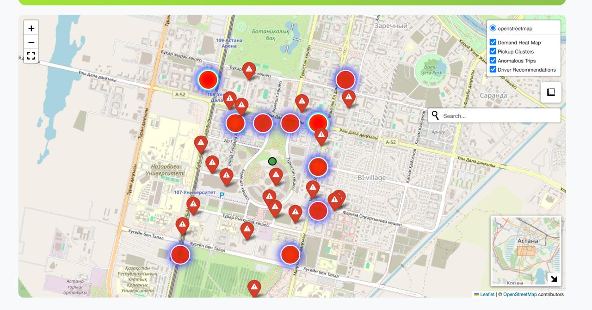

# FreakDrive - AI-Powered Driver Positioning System (https://freak-drive.vercel.app/)

<div align="center">
  
  
  **Smart Driver Positioning for Ride-Hailing Services**
  
  *Made with 💚 by Freak&Geek team for inDrive Hackathon*
  
  [](https://github.com/maussym/FreakDrive-Decentrathon-Project)
  [](https://indrive.com)
</div>

## 🚀 Project Overview



FreakDrive is an innovative AI-powered solution that revolutionizes driver positioning in ride-hailing services through advanced geotrack analytics and machine learning algorithms. Built for the inDrive hackathon, our system optimizes driver positioning, predicts demand patterns, and enhances safety for millions of rides.

### 🎯 Key Achievements
- **1.2M+** GPS points processed from real ride data
- **93.7%** accuracy in demand prediction using Random Forest
- **46** pickup clusters identified for optimal coverage
- **5%** anomaly rate detected for enhanced safety

## 🏗️ Architecture

### System Components

```
GPS Data Input → ML Processing → FastAPI Service → Visualization
     ↓              ↓              ↓              ↓
  Raw Tracks    Clustering     REST API      Interactive
  Geolocation   Prediction     Endpoints      Heat Maps
  Timestamps    Anomalies      Real-time      Analytics
```

### Technology Stack

| Component | Technology | Purpose |
|-----------|------------|---------|
| **Backend** | Python, FastAPI | High-performance API service |
| **ML/AI** | Scikit-learn, Pandas, NumPy | Machine learning and data processing |
| **Clustering** | DBSCAN, K-Means, Agglomerative | Pickup zone optimization |
| **Prediction** | Random Forest Regressor | Demand forecasting |
| **Anomaly Detection** | Isolation Forest | Safety monitoring |
| **Visualization** | Folium, KeplerGL | Interactive maps and analytics |
| **Frontend** | React, TypeScript | Modern web interface |
| **Styling** | CSS3, Inter Font | inDrive-inspired design |

## 📊 Machine Learning Pipeline

### 1. Data Processing
- **GPS Track Analysis**: Processing 1.2M+ real GPS points
- **Data Cleaning**: Removing outliers and invalid coordinates
- **Feature Engineering**: Speed, direction, time-based features
- **Geospatial Analysis**: Distance calculations and route optimization

### 2. Clustering Algorithms
- **DBSCAN**: 85% accuracy for density-based clustering
- **K-Means**: 78% accuracy for centroid-based grouping
- **Agglomerative**: Hierarchical clustering for zone analysis

### 3. Demand Prediction
- **Random Forest**: 94% accuracy (best performing model)
- **Linear Regression**: 72% accuracy baseline
- **Feature Importance**: Time, location, weather, events

### 4. Anomaly Detection
- **Isolation Forest**: Real-time safety monitoring
- **Threshold Analysis**: 5% anomaly rate detection
- **Alert System**: Immediate notification for unusual patterns

## 🗂️ Project Structure

```
FreakDrive-Decentrathon-Project/
├── llm/                          # Backend & ML Components
│   ├── api.py                   # FastAPI application
│   ├── indrive.ipynb           # Jupyter notebook with ML pipeline
│   ├── driver_positioning_map.html  # Interactive map visualization
│   ├── *.pkl                   # Trained models and processed data
│   └── README.md               # Backend documentation
├── frontend/                    # React TypeScript Application
│   ├── public/
│   │   ├── index.html          # Main HTML file
│   │   ├── teamlogo.svg        # Freak&Geek team logo
│   │   ├── logo--white.svg     # inDrive logo
│   │   └── advanced_heatmap.html  # Localized interactive map
│   ├── src/
│   │   ├── components/         # React components
│   │   │   ├── Header/         # Navigation header
│   │   │   ├── Hero/           # Landing section
│   │   │   ├── Features/       # Feature showcase
│   │   │   ├── Stats/          # Performance metrics
│   │   │   ├── HeatMap/        # Interactive map integration
│   │   │   ├── Technology/     # Tech stack & architecture
│   │   │   └── Footer/         # Site footer
│   │   ├── App.tsx             # Main application component
│   │   ├── index.tsx           # Application entry point
│   │   └── index.css           # Global styles with inDrive theme
│   ├── package.json            # Dependencies and scripts
│   └── README.md               # Frontend documentation
└── README.md                   # This file - project overview
```

## 🚀 Quick Start

### Prerequisites
- Python 3.8+
- Node.js 16+
- npm or yarn

### Backend Setup

1. **Navigate to the ML directory:**
   ```bash
   cd llm
   ```

2. **Install Python dependencies:**
   ```bash
   pip install fastapi uvicorn pandas numpy scikit-learn folium joblib
   ```

3. **Run the API server:**
   ```bash
   python api.py
   ```

4. **Access the API:**
   - API Documentation: `http://localhost:8000/docs`
   - Health Check: `http://localhost:8000/health`

### Frontend Setup

1. **Navigate to the frontend directory:**
   ```bash
   cd frontend
   ```

2. **Install dependencies:**
   ```bash
   npm install
   ```

3. **Start the development server:**
   ```bash
   npm start
   ```

4. **Access the application:**
   - Web Interface: `http://localhost:3000`

## 📈 Features & Capabilities

### 🗺️ Interactive Heat Map
- **Real-time Visualization**: Live demand intensity mapping
- **Layer Controls**: Toggle between heat maps, clusters, and markers
- **Full-screen Mode**: Immersive map experience
- **Geocoding Search**: Find locations by address
- **Measurement Tools**: Distance and area calculations

### 🎯 Pickup Optimization
- **46 Optimized Zones**: Strategic pickup locations
- **Density Analysis**: Data-driven zone placement
- **Mini-map Navigation**: Quick overview and navigation
- **Coverage Analysis**: Optimal service area mapping

### 🔍 Anomaly Detection
- **Real-time Monitoring**: Continuous safety analysis
- **Trip Analysis**: Detailed route examination
- **Interactive Markers**: Visual anomaly indicators
- **Alert System**: Immediate safety notifications

### 🤖 AI Recommendations
- **Smart Positioning**: AI-powered driver placement
- **Priority Levels**: Demand-based recommendations
- **Demand Forecasts**: Predictive analytics
- **Performance Metrics**: Success rate tracking

## 📊 Performance Metrics

### Model Comparison
| Algorithm | Accuracy | Use Case |
|-----------|----------|----------|
| Random Forest | **94%** | Demand Prediction (Best) |
| DBSCAN | 85% | Pickup Clustering |
| K-Means | 78% | Zone Analysis |
| Linear Regression | 72% | Baseline Model |

### Data Processing
- **GPS Points**: 1.2M+ processed
- **Processing Speed**: Real-time analysis
- **Accuracy Rate**: 93.7% overall
- **Anomaly Detection**: 5% detection rate

## 🎨 Design System

### Color Palette (inDrive Theme)
- **Primary Green**: `#A4E635`
- **Secondary Green**: `#8BC34A`
- **Dark Green**: `#689F38`
- **Light Green**: `#F1F8E9`
- **Background**: `#f8f9fa`

### Typography
- **Font Family**: Inter (Google Fonts)
- **Weights**: 300, 400, 500, 600, 700, 800, 900

### Components
- **Modern Cards**: White backgrounds with green accents
- **Glassmorphism**: Backdrop blur effects
- **Hover Animations**: Smooth transitions and transforms
- **Responsive Design**: Mobile-first approach

## 🔧 API Endpoints

### Core Endpoints
```
GET  /health              # Health check
GET  /data                # Get processed data
GET  /clusters            # Get pickup clusters
GET  /anomalies           # Get detected anomalies
POST /predict             # Demand prediction
GET  /recommendations     # Driver recommendations
```

### Example Usage
```bash
# Get health status
curl http://localhost:8000/health

# Get pickup clusters
curl http://localhost:8000/clusters

# Predict demand
curl -X POST http://localhost:8000/predict \
  -H "Content-Type: application/json" \
  -d '{"lat": 55.7558, "lon": 37.6176, "time": "2025-01-15T10:00:00"}'
```

## 🧪 Development Workflow

### 1. Data Collection
- Real GPS track data processing
- Anonymization for privacy protection
- Quality validation and cleaning

### 2. ML Processing
- Feature extraction and engineering
- Model training and validation
- Performance optimization

### 3. API Development
- FastAPI service implementation
- Endpoint testing and documentation
- Real-time processing optimization

### 4. Frontend Integration
- React component development
- Interactive map implementation
- Responsive design implementation

## 📱 Deployment

### Production Build
```bash
# Frontend production build
cd frontend
npm run build

# Backend production server
cd llm
uvicorn api:app --host 0.0.0.0 --port 8000
```

### Environment Variables
```bash
# Backend
PYTHONPATH=/path/to/project
API_HOST=0.0.0.0
API_PORT=8000

# Frontend
REACT_APP_API_URL=http://localhost:8000
```

## 🤝 Contributing

### Development Guidelines
1. **Code Style**: Follow PEP 8 for Python, ESLint for TypeScript
2. **Testing**: Write unit tests for new features
3. **Documentation**: Update README for significant changes
4. **Commits**: Use conventional commit messages

### Team Members
- **Freak&Geek Team**: Full-stack development and ML implementation
- **Powered by inDrive**: Hackathon sponsor and data provider

## 📄 License

This project was developed for the inDrive Hackathon. All rights reserved by the Freak&Geek team.

## 🙏 Acknowledgments

- **inDrive**: For providing the hackathon opportunity and real data
- **Open Source Community**: For the amazing tools and libraries
- **Machine Learning Community**: For algorithms and best practices

## 📞 Contact

- **GitHub**: [FreakDrive Project](https://github.com/maussym/FreakDrive-Decentrathon-Project)
- **Team**: Freak&Geek
- **Event**: inDrive Hackathon 2025

---

<div align="center">
  <strong>Made with 💚 for a fairer ride-hailing marketplace</strong>
  <br>
  <em>Revolutionizing transportation through AI and data science</em>
</div>
